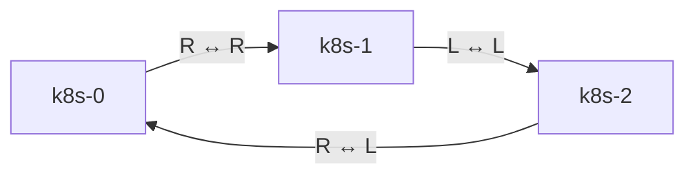

# Thunderbolt Ring Network

## Overview

The cluster uses a dedicated Thunderbolt 4 ring network for high-speed storage replication traffic. This provides a low-latency, high-bandwidth interconnect between all control-plane nodes, optimized for Rook/Ceph storage operations.

## Physical Topology

The three NUC 14 control-plane nodes are connected in a full mesh via Thunderbolt 4 cables. Each NUC has two Thunderbolt 4 ports on the rear panel:
- **Left port**: Domain 0 / Bus `0-1.0`
- **Right port**: Domain 1 / Bus `1-1.0`

### Cabling Diagram



### Physical Connections

| Cable | From Node/Port | To Node/Port |
|-------|----------------|--------------|
| 1 | k8s-0 RIGHT (`1-1.0`) | k8s-1 RIGHT (`1-1.0`) |
| 2 | k8s-0 LEFT (`0-1.0`) | k8s-2 RIGHT (`1-1.0`) |
| 3 | k8s-1 LEFT (`0-1.0`) | k8s-2 LEFT (`0-1.0`) |

## Network Configuration

### IP Addressing

Each node has a unique /32 IP address assigned to both thunderbolt interfaces:

| Node | IP Address | Interface 1 | Interface 2 |
|------|------------|-------------|-------------|
| k8s-0 | `169.254.255.20/32` | enx023b986bed45 | enx02785ac76179 |
| k8s-1 | `169.254.255.21/32` | enx029ac4998b91 | enx02402501bee4 |
| k8s-2 | `169.254.255.22/32` | enx02ea7e5c67a5 | enx026ec8437865 |

### Routing Table

Point-to-point routes with metric 2048 ensure traffic to each peer uses the correct interface:

**k8s-0:**
- `169.254.255.21/32` → `enx023b986bed45` (to k8s-1, bus `1-1.0`)
- `169.254.255.22/32` → `enx02785ac76179` (to k8s-2, bus `0-1.0`)

**k8s-1:**
- `169.254.255.20/32` → `enx029ac4998b91` (to k8s-0, bus `1-1.0`)
- `169.254.255.22/32` → `enx02402501bee4` (to k8s-2, bus `0-1.0`)

**k8s-2:**
- `169.254.255.20/32` → `enx02ea7e5c67a5` (to k8s-0, bus `1-1.0`)
- `169.254.255.21/32` → `enx026ec8437865` (to k8s-1, bus `0-1.0`)

### Network Parameters

- **MTU**: 65,520 bytes (jumbo frames for Thunderbolt)
- **Metric**: 2048 (lower priority than main network)
- **Network CIDR**: `169.254.255.0/24` (link-local addressing)
- **Route Scope**: link (on-link routing for /32 addresses)

## Talos Configuration

The network is configured in `kubernetes/bootstrap/talos/talconfig.yaml` using device selectors to match interfaces by bus path and driver:

```yaml
networkInterfaces:
  - # k8s-0 to k8s-1
    deviceSelector:
      driver: thunderbolt-net
      busPath: "1-1.0"
    addresses:
      - "169.254.255.20/32"
    mtu: 65520
    routes:
      - network: 169.254.255.21/32
        metric: 2048
  - # k8s-0 to k8s-2
    deviceSelector:
      driver: thunderbolt-net
      busPath: "0-1.0"
    addresses:
      - "169.254.255.20/32"
    mtu: 65520
    routes:
      - network: 169.254.255.22/32
        metric: 2048
```

The configuration generates Talos v1alpha1 `LinkAliasConfig` and `LinkConfig` resources with auto-generated interface aliases (`ethSel0`, `ethSel1`).

## Performance Characteristics

Based on iperf3 testing with 4 parallel streams:

### Throughput

| Link | Bandwidth | Retransmits |
|------|-----------|-------------|
| k8s-0 ↔ k8s-1 | 26.5 Gbps | 0.18% |
| k8s-1 ↔ k8s-2 | 26.7 Gbps | 0.17% |
| k8s-2 ↔ k8s-0 | 26.7 Gbps | 0.17% |

**Average**: 26.6 Gbps aggregate throughput

### Latency

- **Ping RTT**: ~0.15ms average
- **Min**: 0.13ms
- **Max**: 0.35ms

### Reliability

- **Packet Loss**: 0%
- **Interface Errors**: 0
- **Dropped Packets**: 0
- **Carrier Errors**: 0

## Rook/Ceph Integration

The Thunderbolt network is configured as the Ceph cluster network for OSD-to-OSD replication traffic in `kubernetes/apps/rook-ceph/rook-ceph/cluster/helmrelease.yaml`:

```yaml
network:
  provider: host
  connections:
    requireMsgr2: true
  addressRanges:
    cluster:
      - 169.254.255.0/24
```

### Network Separation

- **Public Network** (default): Client traffic, CSI operations, dashboard access
- **Cluster Network** (169.254.255.0/24): OSD replication, recovery, backfill operations

This configuration:
- Isolates heavy replication traffic from client operations
- Utilizes the high-bandwidth Thunderbolt links (26.6 Gbps)
- Reduces congestion on the main network
- Optimizes data locality with direct node-to-node connections

## Verification Commands

### Check Interface Status

```bash
# View thunderbolt interfaces on all nodes
talosctl --nodes 10.20.0.230,10.20.0.229,10.20.0.244 get links | grep thunderbolt

# Check IP addresses
talosctl --nodes 10.20.0.230 get addresses | grep 169.254.255

# View routing table
talosctl --nodes 10.20.0.230 get routes | grep 169.254.255
```

### Test Connectivity

```bash
# Run ping test from k8s-0 to k8s-1
kubectl run ping-test --image=nicolaka/netshoot --rm -it --restart=Never \
  --overrides='{"spec":{"nodeSelector":{"kubernetes.io/hostname":"k8s-0"},"hostNetwork":true}}' \
  -- ping -c 4 -I 169.254.255.20 169.254.255.21

# Test MTU with jumbo frames
kubectl run mtu-test --image=nicolaka/netshoot --rm -it --restart=Never \
  --overrides='{"spec":{"nodeSelector":{"kubernetes.io/hostname":"k8s-0"},"hostNetwork":true}}' \
  -- ping -c 3 -M do -s 65492 -I 169.254.255.20 169.254.255.21
```

### Performance Testing

```bash
# Start iperf3 server on k8s-1
kubectl run iperf3-server --image=nicolaka/netshoot --restart=Never \
  --overrides='{"spec":{"nodeSelector":{"kubernetes.io/hostname":"k8s-1"},"hostNetwork":true}}' \
  -- iperf3 -s -B 169.254.255.21

# Run iperf3 client from k8s-0 (in another terminal)
kubectl run iperf3-client --image=nicolaka/netshoot --restart=Never \
  --overrides='{"spec":{"nodeSelector":{"kubernetes.io/hostname":"k8s-0"},"hostNetwork":true}}' \
  -- iperf3 -c 169.254.255.21 -B 169.254.255.20 -t 10 -P 4

# View results
kubectl logs iperf3-client

# Cleanup
kubectl delete pod iperf3-server iperf3-client
```

### Check for Errors

```bash
# Check interface statistics
kubectl run check-stats --image=nicolaka/netshoot --rm -it --restart=Never \
  --overrides='{"spec":{"nodeSelector":{"kubernetes.io/hostname":"k8s-0"},"hostNetwork":true}}' \
  -- ip -s link show | grep -A8 thunderbolt

# Check kernel logs for thunderbolt issues
talosctl --nodes 10.20.0.230 dmesg | grep -i "thunderbolt.*err\|thunderbolt.*warn"
```

### Verify Ceph is Using the Network

```bash
# Check Ceph network configuration
kubectl -n rook-ceph exec -it deploy/rook-ceph-tools -- ceph config dump | grep network

# View OSD network bindings (should show 169.254.255.x for cluster network)
kubectl -n rook-ceph exec -it deploy/rook-ceph-tools -- ceph osd dump | grep cluster_addr
```

### Benchmarking

Test performance using yaskers kbench [fork](https://github.com/yasker/kbench):

```
kubectl apply -f https://raw.githubusercontent.com/yasker/kbench/main/deploy/fio.yaml
```

These are my results post setup using Samsung 990 Pro drives:

```
TEST_FILE: /volume/test
TEST_OUTPUT_PREFIX: test_device
TEST_SIZE: 30G
Benchmarking iops.fio into test_device-iops.json
Benchmarking bandwidth.fio into test_device-bandwidth.json
Benchmarking latency.fio into test_device-latency.json

=========================
FIO Benchmark Summary
For: test_device
CPU Idleness Profiling: disabled
Size: 30G
Quick Mode: disabled
=========================
IOPS (Read/Write)
        Random:           59,921 / 5,964
    Sequential:            4,753 / 6,077

Bandwidth in KiB/sec (Read/Write)
        Random:      1,942,720 / 590,383
    Sequential:        836,760 / 631,062


Latency in ns (Read/Write)
        Random:      350,069 / 6,623,825
    Sequential:      353,699 / 5,381,009
```

Read ops are mostly unchanged since data is read from the local OSD and don't traverse the network. 

Writes however have improved from ~200MiB/s to ~600MiB/s. So a pretty nice 3x increase for my troubles :rocket:

The other key metric here is latency. There is less of an improvement seen here and 5-6ms is about what we should expect from "consumer" drives.


## Troubleshooting

### No Connectivity Between Nodes

1. **Verify interface status**: Ensure all thunderbolt interfaces show `operstate=up`
   ```bash
   talosctl --nodes 10.20.0.230 get links | grep thunderbolt
   ```

2. **Check physical cables**: Verify Thunderbolt cables are securely connected

3. **Verify bus paths**: Confirm bus paths match the physical topology
   ```bash
   talosctl --nodes 10.20.0.230 dmesg | grep "thunderbolt.*Linux"
   ```

4. **Test ARP**: Verify layer 2 connectivity
   ```bash
   kubectl run arping-test --image=nicolaka/netshoot --rm -it --restart=Never \
     --overrides='{"spec":{"nodeSelector":{"kubernetes.io/hostname":"k8s-0"},"hostNetwork":true}}' \
     -- arping -c 4 -I enx023b986bed45 169.254.255.21
   ```

### Bus Path Mismatch

If ARP works in one direction but not the other, the bus paths may be swapped in the configuration:

1. Check which remote host is connected to each bus path:
   ```bash
   talosctl --nodes 10.20.0.230 dmesg | grep -E "thunderbolt.*found|thunderbolt.*Linux"
   ```

2. Update `talconfig.yaml` with correct bus paths for each link

3. Regenerate and apply Talos configuration:
   ```bash
   task talos:generate-config
   task talos:apply-config
   ```

### Low Performance

1. **Verify MTU**: Ensure jumbo frames are working
   ```bash
   ping -c 3 -M do -s 65492 -I 169.254.255.20 169.254.255.21
   ```

2. **Check interface errors**:
   ```bash
   ip -s link show | grep -A8 thunderbolt
   ```

3. **Verify Thunderbolt mode**: Should be operating at full speed (40 Gbps for TB4)
   ```bash
   dmesg | grep thunderbolt | grep speed
   ```

### Ceph Not Using Thunderbolt Network

1. **Verify network configuration** in the HelmRelease
2. **Check OSD bindings**:
   ```bash
   kubectl -n rook-ceph exec -it deploy/rook-ceph-tools -- ceph daemon osd.0 config show | grep cluster_network
   ```
3. **Review OSD logs** for network binding messages:
   ```bash
   kubectl -n rook-ceph logs -l app=rook-ceph-osd --tail=100 | grep "cluster_network\|public_network"
   ```

## Hardware Requirements

- **Nodes**: Intel NUC 14 (or equivalent with Thunderbolt 4 ports)
- **Cables**: 3x Thunderbolt 4 cables (0.5m is perfect for rack-mount setups). I used these cables from Cable Matters https://www.amazon.co.uk/dp/B0CFGBSY7M. These are "Intel Certified" which makes them slightly more expensive. Nobody needs to run the gauntlet of "thunderbolt compatible" cables in their Ceph setup however.

- **OS**: Talos Linux 1.12.0+ with thunderbolt kernel module support

## References

- [Talos Network Configuration](https://www.talos.dev/latest/reference/configuration/#networkconfig)
- [Rook Ceph Network Configuration](https://rook.io/docs/rook/latest/CRDs/Cluster/ceph-cluster-crd/#network-configuration-settings)
- [Ceph Network Documentation](https://docs.ceph.com/en/latest/rados/configuration/network-config-ref/)
